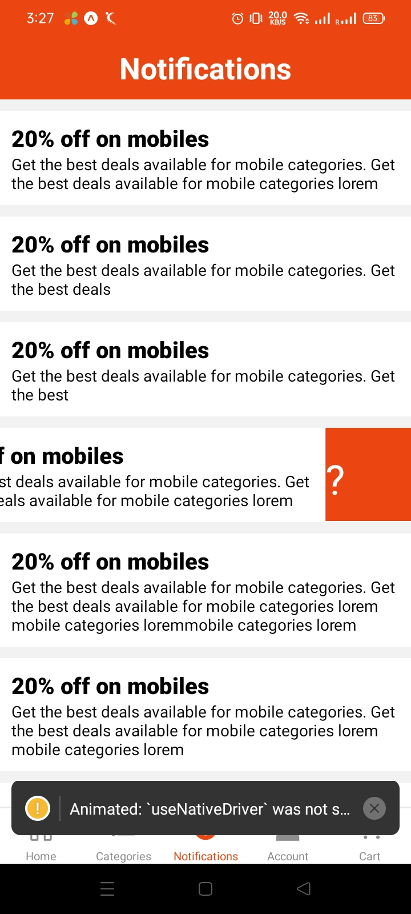

# Mobile App of Ecom

User can buy products from this mobile app.

### Start the development server
```
  npm run start
```

- Note: Update expo SDK to latest
```
  npm i expo@latest
  
  npx expo install --fix
```

### Demo





